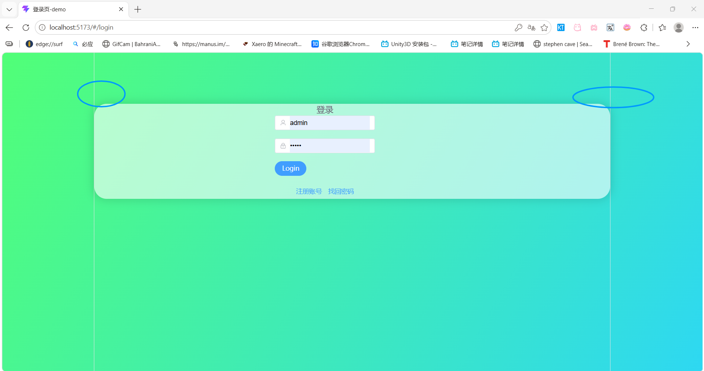

【HTML+CSS 一个简洁的登录界面】https://www.bilibili.com/video/BV1X3411y7of?vd_source=3424baa0ba17a6687e097f58c68731c5


【Vue3+Vite+Element-Plus实战商城后台管理系统】https://www.bilibili.com/video/BV13f1zBLEo6?p=65&vd_source=3424baa0ba17a6687e097f58c68731c5


```text
//beginWithVite
npm -v
npm config get registry
npm config set registry=https://registry.npmmirror.com
npm init vite@latest shop-admin --template vue
cd shop-admin
npm install
npm run dev

npm install three
```


| 属性值     | 定位参考                 | 是否脱离文档流                   | 使用场景                           |
| :--------- | :----------------------- | :------------------------------- | :--------------------------------- |
| `static`   | 无（默认定位）           | ❌ 否                             | 默认值，无需设置                   |
| `relative` | 自身原本位置             | ❌ 否（保留原占位）               | 微调元素位置、作为绝对定位的父容器 |
| `absolute` | 最近的非 `static` 父元素 | ✅ 是                             | 下拉菜单、角标、自定义弹窗         |
| `fixed`    | 浏览器视口（窗口）       | ✅ 是                             | 固定导航、回到顶部、弹窗           |
| `sticky`   | 父容器 + 滚动容器        | 混合（未滚动时占位，滚动后固定） | 吸顶导航、表头固定                 |


```text
position 所有属性值介绍


position 属性控制元素的定位方式，决定元素在页面中的位置。


一、所有属性值一览

static    → 定位参考：无（默认定位）→ 是否脱离文档流：否 → 使用场景：默认值，无需设置
relative  → 定位参考：自身原本位置 → 是否脱离文档流：否（保留原占位）→ 使用场景：微调元素位置、作为绝对定位的父容器
absolute  → 定位参考：最近的非 static 父元素 → 是否脱离文档流：是 → 使用场景：下拉菜单、角标、自定义弹窗
fixed     → 定位参考：浏览器视口（窗口）→ 是否脱离文档流：是 → 使用场景：固定导航、回到顶部、弹窗
sticky    → 定位参考：父容器 + 滚动容器 → 是否脱离文档流：混合（未滚动时占位，滚动后固定）→ 使用场景：吸顶导航、表头固定


二、详细说明

static（默认值）
元素按正常文档流排列，top/left/right/bottom 对其无效。
.box { position: static; }

relative（相对定位）
相对于自身原本位置偏移，原来占的空间还在，其他元素不会补位。
.box { position: relative; top: 10px; left: 20px; }

absolute（绝对定位）
相对于最近的非 static 父元素定位，完全脱离文档流，其他元素会补位。
.parent { position: relative; }
.child { position: absolute; top: 0; right: 0; }

fixed（固定定位）
相对于浏览器窗口定位，滚动时位置不变。
.header { position: fixed; top: 0; left: 0; right: 0; }

sticky（粘性定位）
结合 relative 和 fixed 的特点：未滚动时占位，滚动到阈值时固定。
.nav { position: sticky; top: 0; }


三、定位偏移属性

top: 10px;     → 离顶部 10px
bottom: 10px;  → 离底部 10px
left: 10px;    → 离左侧 10px
right: 10px;   → 离右侧 10px


四、z-index 控制层级

当元素重叠时，z-index 值越大越靠上。
.box1 { position: fixed; z-index: 100; }
.box2 { position: fixed; z-index: 50; }


五、常见场景示例

固定导航栏：
.header {
  position: fixed;
  top: 0;
  left: 0;
  right: 0;
  z-index: 999;
}

吸顶导航：
.nav {
  position: sticky;
  top: 0;
  z-index: 50;
}

弹窗居中：
.modal {
  position: fixed;
  top: 50%;
  left: 50%;
  transform: translate(-50%, -50%);
  z-index: 1000;
}

右下角回到顶部：
.back-to-top {
  position: fixed;
  bottom: 30px;
  right: 30px;
}


六、总结表

static    → “站那别动” → 什么都不做
relative  → “自己挪个位置，但原来的坑还在” → 微调位置、给子元素做参考
absolute  → “离开队伍，跟最近的队长走” → 下拉菜单、角标
fixed     → “钉在窗户上，怎么滚动都不动” → 固定导航、弹窗
sticky    → “平时站着，滚到边缘就粘住” → 吸顶导航


记忆口诀：
static 是默认，relative 原地偏
absolute 跟父走，fixed 钉窗边
sticky 粘性定位，滚动到边就固定
```


```text
<!DOCTYPE html>
<html>
<head>
  <meta charset="UTF-8">
  <title>position 五种定位演示</title>
  <style>
    * { margin: 0; padding: 0; box-sizing: border-box; }
    body { font-family: Arial; padding: 20px; background: #f0f2f5; }

    .container { max-width: 700px; margin: 0 auto; }

    .title {
      text-align: center;
      padding: 20px;
      background: #fff;
      border-radius: 8px;
      margin-bottom: 20px;
      font-size: 20px;
    }

    .card {
      background: #fff;
      border-radius: 8px;
      padding: 16px 20px;
      margin-bottom: 16px;
      border-left: 4px solid #409EFF;
    }
    .card .label {
      font-weight: bold;
      color: #409EFF;
    }

    .box {
      width: 80px;
      height: 50px;
      color: #fff;
      font-size: 13px;
      font-weight: bold;
      display: flex;
      align-items: center;
      justify-content: center;
      border-radius: 4px;
    }

    /* 父容器（用于 relative/absolute 演示） */
    .relative-box {
      position: relative;
      background: #f5f7fa;
      padding: 30px 20px;
      border: 2px dashed #ccc;
      border-radius: 6px;
      min-height: 120px;
      margin-top: 8px;
    }
    .relative-box .label {
      font-size: 12px;
      color: #999;
      font-weight: normal;
    }

    .static-box { background: #909399; }
    .relative-demo { background: #E6A23C; position: relative; top: 10px; left: 20px; }
    .absolute-demo { background: #F56C6C; position: absolute; top: 10px; right: 10px; }
    .fixed-demo { background: #67C23A; position: fixed; bottom: 20px; right: 20px; z-index: 999; }
    .sticky-demo { background: #409EFF; position: sticky; top: 0; z-index: 100; }

    .fixed-note {
      background: #fff3cd;
      padding: 10px 16px;
      border-radius: 6px;
      font-size: 14px;
      text-align: center;
      margin-top: 10px;
      border: 1px solid #ffc107;
    }
  </style>
</head>
<body>

<div class="container">

  <div class="title">📐 position 五种定位方式</div>

  <!-- 1. static -->
  <div class="card">
    <span class="label">1. static</span>（默认，无定位）
    <div style="margin-top:8px;">
      <div class="box static-box">static</div>
    </div>
  </div>

  <!-- 2. relative -->
  <div class="card">
    <span class="label">2. relative</span>（相对自身位置偏移，原占位保留）
    <div style="margin-top:8px;">
      <div class="box static-box" style="display:inline-block;">原位置</div>
      <div class="box relative-demo" style="display:inline-block;">relative<br><span style="font-size:10px;">↘ 偏移</span></div>
    </div>
  </div>

  <!-- 3. absolute -->
  <div class="card">
    <span class="label">3. absolute</span>（相对最近的非static父元素定位，脱离文档流）
    <div class="relative-box">
      <span class="label">⬅ 父容器 position: relative</span>
      <div class="box absolute-demo">absolute</div>
      <div style="color:#999; font-size:13px; margin-top:20px;">
        红色框在父容器右上角，脱离文档流
      </div>
    </div>
  </div>

  <!-- 4. fixed -->
  <div class="card">
    <span class="label">4. fixed</span>（相对视口固定，滚动不动）
    <div class="box fixed-demo">fixed</div>
    <div class="fixed-note">
      ✅ 绿色框固定在右下角，滚动页面它不动
    </div>
  </div>

  <!-- 5. sticky -->
  <div class="card" style="border-left-color:#409EFF;">
    <span class="label">5. sticky</span>（滚动到顶部时固定）
    <div style="background:#f5f7fa; padding:12px; border-radius:4px; margin-top:8px;">
      <div style="background:#409EFF; color:#fff; padding:12px; border-radius:4px; text-align:center; position:sticky; top:0; z-index:10;">
        ⭐ sticky 导航栏 — 滚到顶部时吸住
      </div>
      <div style="padding:12px; color:#666; font-size:13px; line-height:2;">
        <p>↓ 继续滚动，蓝色条会吸在顶部</p>
        <p>↓ 这就是 sticky 的效果</p>
        <p>↓ 滚动试试看</p>
        <p>↓ ...</p>
      </div>
    </div>
  </div>

  <!-- 总结 -->
  <div class="card" style="border-left-color:#909399; background:#fafafa;">
    <span class="label">📌 总结</span>
    <div style="font-size:13px; color:#555; margin-top:6px; line-height:1.8;">
      <strong>static</strong> → 默认，无定位<br>
      <strong>relative</strong> → 相对自身偏移，占位保留<br>
      <strong>absolute</strong> → 相对父元素定位，脱离文档流<br>
      <strong>fixed</strong> → 相对视口固定，滚动不动<br>
      <strong>sticky</strong> → 滚动到阈值时固定
    </div>
  </div>

  <div style="height:300px;"></div>

</div>

</body>
</html>
```


| 情况                 | 是否脱离 | 说明                       |
| :------------------- | :------- | :------------------------- |
| `position: static`   | ❌ 否     | 默认，正常排               |
| `position: relative` | ❌ 否     | 自己挪位置，但**占位还在** |
| `position: absolute` | ✅ 是     | 完全脱离，不占位           |
| `position: fixed`    | ✅ 是     | 完全脱离，不占位           |
| `position: sticky`   | 混合     | 正常时占位，固定时不占位   |
| `float: left/right`  | ✅ 是     | 浮动脱离，文字环绕         |


| 属性值           | 效果                       | 图示                 |
| :--------------- | :------------------------- | :------------------- |
| `repeat`（默认） | 水平和垂直都重复，铺满容器 | `[图][图][图]`       |
| `no-repeat`      | 只显示一张，不重复         | `[图]`（只有一张）   |
| `repeat-x`       | 只在水平方向重复           | `[图][图][图]`       |
| `repeat-y`       | 只在垂直方向重复           | `[图]` `[图]` `[图]` |

| 伪类        | 触发时机                 | 示例           |
| :---------- | :----------------------- | :------------- |
| `:hover`    | 鼠标**悬停**时           | 按钮变暗       |
| `:active`   | 鼠标**按下**时（未松开） | 按钮缩小       |
| `:focus`    | 元素**获得焦点**时       | 输入框边框变蓝 |
| `:visited`  | 链接**已被访问**后       | 链接变紫       |
| `:link`     | 链接**未被访问**时       | 链接变蓝       |
| `:disabled` | 元素**被禁用**时         | 按钮灰色不可点 |

```text
//display
一维布局（一行或一列）→ 用 flex
二维布局（行和列同时控制）→ 用 grid
普通文本内容 → 用默认 block/inline
不需要显示 → 用 none

flex → 一维布局（行/列），适合组件内部排列、居中对齐
grid → 二维布局（行+列），适合页面整体结构
block → 独占一行
inline → 文字内联
inline-block → 并排但可设宽高
none → 隐藏
```

| 对比         | Flex                       | Grid                       |
| :----------- | :------------------------- | :------------------------- |
| **维度**     | 一维（行或列）             | 二维（行和列同时控制）     |
| **适用场景** | 组件内部排列、导航栏、居中 | 页面整体布局、相册、仪表盘 |
| **对齐方式** | 主轴 + 交叉轴              | 行 + 列（更强大）          |
| **学习曲线** | 简单                       | 稍复杂                     |

| 属性                    | 值            | 图中效果                                  |
| :---------------------- | :------------ | :---------------------------------------- |
| `grid-template-columns` | `1fr 1fr 1fr` | 3列等宽（黄色占前2列，绿色占第3列一部分） |
| `grid-template-rows`    | `60px 60px`   | 2行，每行60px                             |
| `gap`                   | `10px`        | 元素之间10px间距                          |
| `grid-column: 1 / 3`    | 黄色元素      | 占第1列到第3列（横跨2列）                 |
| `grid-row: 1 / 3`       | 绿色元素      | 占第1行到第3行（纵跨2行）                 |

```javascript
<!DOCTYPE html>
<html>
<head>
  <style>
    .grid {
      display: grid;
      grid-template-columns: 1fr 1fr 1fr; /* 3列等宽 */
      grid-template-rows: 50px 50px;      /* 2行，每行50px */
      gap: 10px;
    }
    .grid div {
      background: #409EFF;
      color: #fff;
      text-align: center;
      padding: 8px;
      border-radius: 4px;
    }
    .c2 { grid-column: 1 / 3; background: #E6A23C; } /* 跨2列 */
    .r2 { grid-row: 1 / 3; background: #67C23A; }   /* 跨2行 */
  </style>
</head>
<body>

  <div class="grid">
    <div class="c2">跨2列</div>
    <div class="r2">跨2行</div>
    <div>3</div>
    <div>4</div>
  </div>

</body>
</html>
```

**`box-sizing: border-box;` 是 CSS 中用来控制元素“宽高计算方式”的属性。设置后，元素的 `width` 和 `height` 会包含 `padding`（内边距）和 `border`（边框），让布局更容易控制。**


```text
.f-menu::-webkit-scrollbar {
    width: 0px;
}
```

| 写法 | 名称                     | 作用                   | 示例                                                         |
| :--- | :----------------------- | :--------------------- | :----------------------------------------------------------- |
| `:`  | 伪类（Pseudo-class）     | 选中元素的**特定状态** | `:hover`（悬停）、`:focus`（焦点）、`:first-child`（第一个子元素） |
| `::` | 伪元素（Pseudo-element） | 选中元素的**特定部分** | `::before`（内容前）、`::after`（内容后）、`::-webkit-scrollbar`（滚动条） |


**`z-index: 100` 是 CSS 中用来控制元素“上下堆叠顺序”的属性，值越大，元素显示在越上面。**




```javascript
消除白线  #app的样式改了就行
白线来自npm create vite@latest my-app --template vue
E:\front-end\vueVite\SimpleLoginInterface\src\style.css
在main.js里 // import './style.css'   // ← 注释掉这行
html, body, #app {
    width: 100%;           /* 宽度撑满 */
    min-height: 100vh;     /* 高度至少占满视口 */
    margin: 0;             /* 去掉 body 默认边距 */
    padding: 0;            /* 去掉任何默认内边距 */
}


白线来源：
1. body 默认 margin: 8px（产生四周空白）
2. #app 没有高度，底部没有填满（露出 body 背景）

你的修复：
html, body, #app { min-height: 100vh; margin: 0; padding: 0; }
→ 白线消失 ✅
```

默认情况下，堆叠顺序是：

1. 元素背景（最底层）
2. `::before`
3. 元素内容
4. `::after`（最顶层）

所以 `::after` 默认会在 `::before` **上面**。


```text
.box .left::before{
    content: '';
    position: absolute;
    width: 100%;
    height: 100%;
    background-image: url(../assets/images/login.jpg);
    background-size: cover;
    opacity: 0.8;
}


background-size:
值	效果	是否裁剪
cover	图片铺满整个容器	✅ 可能会裁剪
contain	图片完整显示在容器内	❌ 不裁剪，但可能有留白
100% 100%	图片拉伸填满	✅ 可能变形
```

| 写法                                         | 含义                                 | 适用场景     |
| :------------------------------------------- | :----------------------------------- | :----------- |
| `(max-width: 768px)`                         | 屏幕宽度 **≤ 768px** 时生效          | 手机、小平板 |
| `(min-width: 768px)`                         | 屏幕宽度 **≥ 768px** 时生效          | 平板、桌面   |
| `(min-width: 768px) and (max-width: 1024px)` | 屏幕宽度在 **768~1024px** 之间时生效 | 平板         |
| `(orientation: portrait)`                    | **竖屏**时生效                       | 手机竖屏     |
| `(orientation: landscape)`                   | **横屏**时生效                       | 手机横屏     |
| `(prefers-color-scheme: dark)`               | 系统**深色模式**时生效               | 暗色主题     |
| `(prefers-color-scheme: light)`              | 系统**浅色模式**时生效               | 亮色主题     |
| `print`                                      | **打印**时生效                       | 打印样式     |
| `screen`                                     | **屏幕**显示时生效                   | 普通网页     |

**768px 不是一个“算出来的”数学值，而是业界约定俗成的“断点”（Breakpoint）。**

| 断点     | 名称            | 代表设备              |
| :------- | :-------------- | :-------------------- |
| ≤ 480px  | 手机小屏        | 小屏手机              |
| ≤ 768px  | **手机/小平板** | **iPhone、iPad mini** |
| ≤ 1024px | 平板            | iPad、小笔记本        |
| ≤ 1200px | 笔记本          | 普通笔记本            |
| > 1200px | 大屏桌面        | 台式机、大屏显示器    |

```
background-position: 水平位置 垂直位置;
left 是 left center 的简写，两者都表示“水平靠左 + 垂直居中”。
```

| 写法          | 水平                  | 垂直             | 效果                              |
| :------------ | :-------------------- | :--------------- | :-------------------------------- |
| `left`        | `left`（默认 center） | 居中             | 靠左 + 垂直居中                   |
| `left center` | `left`                | `center`         | 靠左 + 垂直居中（和 `left` 一样） |
| `left top`    | `left`                | `top`            | 左上角                            |
| `center`      | `center`（默认）      | `center`（默认） | 居中                              |
| `center top`  | `center`              | `top`            | 水平居中 + 靠上                   |


```text
.box .left::before{
    content: '';
    position: absolute;
    width: 100%;
    height: 100%;
    background-image: url(../images/image01.jpg);
    background-size: cover;
    background-position:left center;
    opacity: 0.8;
}
```


css  `background-size` 用于控制背景图片的大小。

| 值             | 含义                                              | 效果             |
| :------------- | :------------------------------------------------ | :--------------- |
| `cover`        | 图片**放大/缩小**到完全覆盖容器，可能**裁剪**     | 铺满，不留白     |
| `contain`      | 图片**放大/缩小**到完整显示在容器内，可能**留白** | 完整显示，不裁剪 |
| `100% 100%`    | 图片拉伸到容器大小                                | 可能**变形**     |
| `100px 200px`  | 固定宽高                                          | 精确控制         |
| `50% 50%`      | 相对于容器的百分比                                | 响应式           |
| `auto`（默认） | 保持图片原始尺寸                                  | 可能溢出或留白   |


## 浏览器检查：查看页面元素对应的 CSS

### 方法 1：用选择箭头点击元素（最常用 ✅）

1. 按 `F12` 打开开发者工具
2. 点击左上角的 **选择箭头** 图标（或按 `Ctrl + Shift + C`）
3. 在页面上**点击**你想查看的元素
4. 右侧 **Styles** 面板会显示该元素的所有 CSS 样式


### 所有 `justify-content` 值对比

| 值                   | 效果                   | 示意              |
| :------------------- | :--------------------- | :---------------- |
| `flex-start`（默认） | 靠左排列               | `[A][B][C]____`   |
| `flex-end`           | 靠右排列               | `____[A][B][C]`   |
| `center`             | 居中排列               | `__[A][B][C]__`   |
| `space-between`      | **两端对齐，中间平分** | `[A]___[B]___[C]` |
| `space-around`       | 每个元素两侧间距相等   | `_[A]_[B]_[C]_`   |
| `space-evenly`       | 所有间距完全相等       | `_[A]__[B]__[C]_` |

| 情况               | 说明                               | 解决方法                |
| :----------------- | :--------------------------------- | :---------------------- |
| **内容溢出**       | 文字太长，超出盒子                 | `overflow: hidden` 裁剪 |
| **定位溢出**       | `position: absolute` 偏移出盒子    | 调整 `top/left` 值      |
| **transform 溢出** | `transform: translateX()` 移出盒子 | 调整百分比或删除        |
| **margin 溢出**    | 负 `margin` 把元素拉出盒子         | 调整 `margin` 值        |

| 方法           | 代码                         | 效果                   |
| :------------- | :--------------------------- | :--------------------- |
| **隐藏溢出**   | `overflow: hidden;`          | 裁掉超出的部分         |
| **显示滚动条** | `overflow: auto;`            | 超出的部分通过滚动查看 |
| **允许溢出**   | `overflow: visible;`（默认） | 内容直接显示在外面     |
| **文字换行**   | `word-wrap: break-word;`     | 文字自动换行           |

默认情况下，堆叠顺序是：

1. 元素背景（最底层）
2. `::before`
3. 元素内容
4. `::after`（最顶层）

所以 `::after` 默认会在 `::before` **上面**。


**`<router-view />` 是“嵌套出口”——在哪里放它，子路由的组件就显示在哪里。**


```text

第一种<router-view></router-view>在router/index里import， 配置子路由，就可以在页面.vue里显示了
import {
    createRouter,
    createWebHashHistory
}from 'vue-router'

import Admin from '~/layouts/admin.vue'
import Index from '~/pages/index.vue'
import Login from '~/pages/login.vue'
import NotFound from '~/pages/404.vue'
import Register from '~/pages/register.vue'
import Forget from '~/pages/forget.vue'
import Doll from '~/pages/doll.vue'

const routes = [{
    path: "/",               // ← 根路径（后台首页）
    component: Admin,        // ← 先加载布局（admin.vue）
    children: [{
        path: "/",             // ← 子路由根路径
        component: Index,      // ← 再加载首页内容（index.vue）
        meta: { title: "后台首页" }
    }]
},{},{}]


第二种，引入页面.vue  直接import ,然后,<页面/>就行
<template>
    <Fdoll />
</template>

<script setup>
import Fdoll from '~/layouts/Fdoll.vue'
</script>

```


```text
多个 children 的写法


const routes = [{
  path: "/",
  component: Admin,
  children: [
    {
      path: "/",
      component: Index,
      meta: { title: "后台首页" }
    },
    {
      path: "users",
      component: Users,
      meta: { title: "用户管理" }
    },
    {
      path: "goods",
      component: Goods,
      meta: { title: "商品管理" }
    },
    {
      path: "orders",
      component: Orders,
      meta: { title: "订单管理" }
    }
  ]
}]


对应关系表：
访问 URL       父组件      子组件      页面标题
/              Admin      Index      后台首页
/users         Admin      Users      用户管理
/goods         Admin      Goods      商品管理
/orders        Admin      Orders     订单管理


目录结构：
src/
├── layouts/
│   └── admin.vue
├── pages/
│   ├── index.vue
│   ├── users.vue
│   ├── goods.vue
│   └── orders.vue
└── router/
    └── index.js


admin.vue 中的 router-view：
<template>
  <div class="admin-layout">
    <aside>
      <router-link to="/">首页</router-link>
      <router-link to="/users">用户</router-link>
      <router-link to="/goods">商品</router-link>
      <router-link to="/orders">订单</router-link>
    </aside>
    <main>
      <router-view />
    </main>
  </div>
</template>


完整 router/index.js：
import { createRouter, createWebHashHistory } from 'vue-router'
import Admin from '~/layouts/admin.vue'
import Index from '~/pages/index.vue'
import Users from '~/pages/users.vue'
import Goods from '~/pages/goods.vue'
import Orders from '~/pages/orders.vue'

const routes = [{
  path: "/",
  component: Admin,
  children: [
    {
      path: "/",
      component: Index,
      meta: { title: "后台首页" }
    },
    {
      path: "users",
      component: Users,
      meta: { title: "用户管理" }
    },
    {
      path: "goods",
      component: Goods,
      meta: { title: "商品管理" }
    },
    {
      path: "orders",
      component: Orders,
      meta: { title: "订单管理" }
    }
  ]
}]

const router = createRouter({
  history: createWebHashHistory(),
  routes
})

export default router


总结：
多个 children 的写法：
children: [
  { path: "/", component: Index },
  { path: "users", component: Users },
  { path: "goods", component: Goods },
  // ...
]

每个子路由对应一个页面组件，都在父布局的 <router-view /> 中显示。
```


```text
Vue 单文件组件中 script 和 style 的区别


一、script 的区别

script         → 普通 JS（Options API），使用 export default，不推荐
script setup   → 组合式 API 语法糖，变量自动暴露，代码更简洁，推荐


代码示例：
// ❌ 普通 script（不推荐）
<script>
export default {
  data() {
    return { count: 0 }
  },
  methods: {
    increment() { this.count++ }
  }
}
</script>

// ✅ script setup（推荐）
<script setup>
import { ref } from 'vue'
const count = ref(0)
const increment = () => count.value++
</script>


二、style 的区别

style          → 全局样式，影响所有页面，谨慎使用
style scoped   → 只影响当前组件，最常用
style module   → 当前组件（哈希类名），通过 $style.xxx 访问，类名唯一


代码示例：
// 最常用：scoped
<style scoped>
.title { color: red; }
</style>

// 全局样式
<style>
* { margin: 0; }
</style>

// CSS Modules
<style module>
.title { color: red; }
</style>


三、style module 详细说明

CSS Modules 会把类名编译成唯一的哈希值，确保完全隔离。


基本用法：
<template>
  <div :class="$style.container">
    <h1 :class="$style.title">Hello Vue</h1>
  </div>
</template>

<style module>
.container { padding: 20px; }
.title { color: #409EFF; }
</style>

编译后：
<div class="_container_1a2b3c">
  <h1 class="_title_1a2b3c">Hello Vue</h1>
</div>


scoped vs module 对比：
scoped   → 原理：给元素加 data-v-xxx 属性，类名不变，通过 :deep() 穿透
module   → 原理：类名变成哈希值，通过 $style.xxx 引用，无法穿透


多个类名组合：
<div :class="[$style.container, $style.active]">多个类</div>
<div :class="[$style.container, isActive && $style.active]">条件类</div>
<div :class="{ [$style.container]: true, [$style.active]: isActive }">对象方式</div>


自定义名称：
<style module="myStyle">
.title { color: red; }
</style>
<div :class="myStyle.title">自定义名称</div>


全局类名（不哈希）：
<style module>
:global(.global-class) { color: red; }
</style>


与 JS 交互：
<script setup>
import { useCssModule } from 'vue'
const style = useCssModule()
console.log(style.container)
</script>


module 适用场景：
组件库开发       → 用 module
大型项目多人协作  → 用 module
普通业务组件     → 用 scoped（够用且简单）
需要覆盖子组件样式 → 不要用 module


四、对比表

script        → 作用范围：全局 → 是否自动暴露：需要 export → 推荐度：❌ 不推荐
script setup  → 作用范围：全局 → 是否自动暴露：✅ 自动 → 推荐度：⭐⭐⭐⭐⭐
style         → 作用范围：全局 → 推荐度：⚠️ 谨慎使用
style scoped  → 作用范围：当前组件 → 推荐度：⭐⭐⭐⭐⭐
style module  → 作用范围：当前组件（哈希） → 推荐度：⭐⭐⭐


五、实际项目中的组合（最常用）
<template>
  <div class="title">{{ msg }}</div>
</template>

<script setup>
import { ref } from 'vue'
const msg = ref('Hello Vue')
</script>

<style scoped>
.title { color: blue; }
</style>


六、总结
script 区别：
script       → Options API 写法（旧）
script setup → 组合式 API 写法（新，推荐）

style 区别：
style        → 全局样式（影响所有页面）
style scoped → 只影响当前组件（推荐）
style module → 生成唯一类名（防冲突）
```


```javascript
       window.open('https://www.bilibili.com/video/BV1FUkcYEEyE/spm_id_from=333.1391.0.0&vd_source=7b46880138058a1e1001ebfdbea0e74a', '_blank')

```


| /参数值            | 作用                                    | 说明                                                       |
| :----------------- | :-------------------------------------- | :--------------------------------------------------------- |
| `'_blank'`         | **在新窗口或新标签页中打开** (默认行为) | 绝大多数现代浏览器会默认在新标签页打开。                   |
| `'_self'`          | **在当前页面（当前窗口/标签页）中打开** | 相当于直接修改 `window.location.href`。                    |
| `'_parent'`        | 在父级框架中打开                        | 主要用于 `<iframe>` 或 `<frameset>` 场景。                 |
| `'_top'`           | 在顶层框架中打开                        | 用于跳出所有嵌套框架，在最顶层窗口加载。                   |
| `'任意自定义名称'` | 在指定名称的窗口/标签页中打开           | 如果该名称的窗口已存在，则在其内打开；否则会新建一个窗口。 |

| 术语             | 含义                                   | 示例                                     |
| :--------------- | :------------------------------------- | :--------------------------------------- |
| **本地静态资源** | 项目文件夹里的图片、视频、CSS、JS 文件 | `/images/b01.jpg`、`src/assets/logo.png` |
| **本地 API**     | 运行在本地电脑上的后端接口服务         | `http://localhost:3000/api/users`        |
| **本地服务器**   | 在本地运行的服务（Vite/Node.js）       | `http://localhost:5173`                  |

| 叫法            | 说明                          |
| :-------------- | :---------------------------- |
| **后端接口**    | 最通俗的叫法，指后端提供的API |
| **API 接口**    | 最通用的叫法                  |
| **RESTful API** | 遵循REST规范的API             |
| **服务端 API**  | 强调运行在服务器端            |
| **HTTP API**    | 强调基于HTTP协议              |

```javascript
// ❌ 原生 JS（代码多）
document.getElementById('btn').addEventListener('click', function() {
  document.getElementById('msg').innerHTML = '点击了！'
  document.getElementById('msg').style.color = 'red'
})

// ✅ jQuery（代码少）
$('#btn').click(function() {
  $('#msg').text('点击了！').css('color', 'red')
})
//          ↑ 链式调用，一行搞定


//jQuery 最著名的特点就是链式调用：
$('#box')
  .css('color', 'red')      // 设置颜色
  .slideDown(300)           // 滑动展开
  .addClass('active')       // 添加类
  .html('新内容')           // 修改内容
// 每个方法都返回 jQuery 对象，可以继续调用
```


```javascript
const arr = [1, 2, 3, 4, 5]

// filter 遍历数组，把每个元素传给回调函数
arr.filter((item) => {
  // ↑ 这个 item 是 filter 自动传的
  // 第1次循环：item = 1
  // 第2次循环：item = 2
  // 第3次循环：item = 3
  // ...
  return item > 2
})
// 结果：[3, 4, 5]
```

